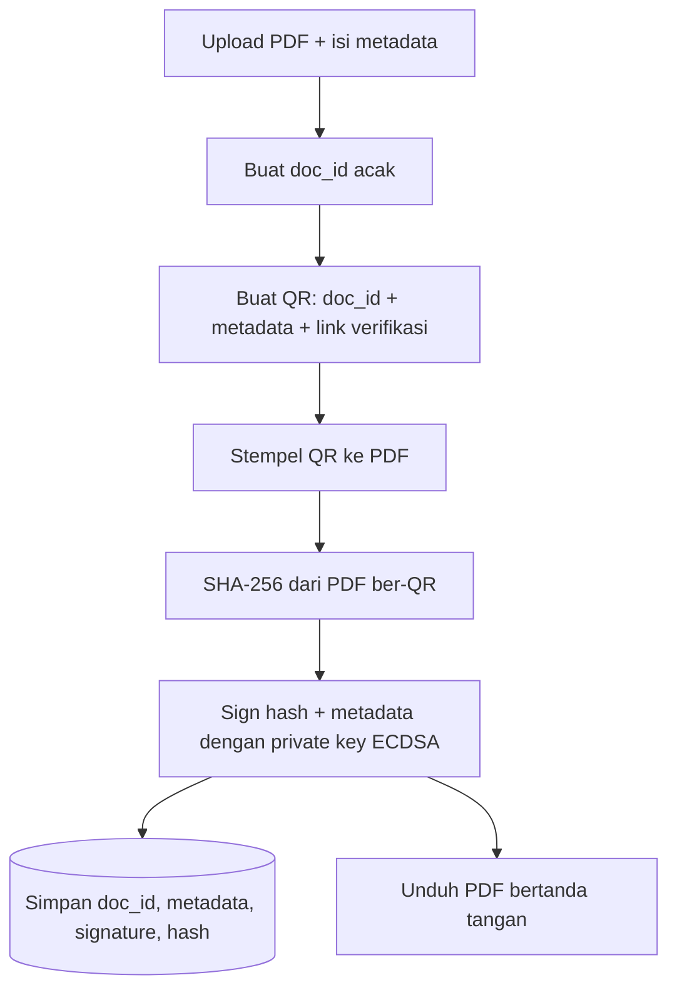
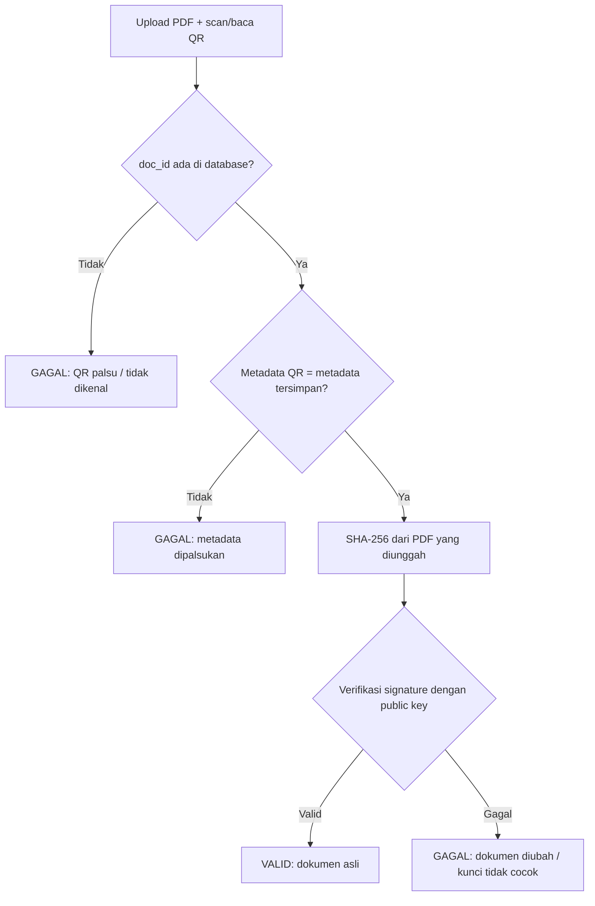

# Aplikasi Digital Signature (ECDSA P-256 + QR-Code)

Tugas Proyek Aplikasi Kriptografi, Keamanan Informasi, Informatika UNSIL.
Topik D: Digital Signature.

**Penyusun:** <Nama> (<NPM>)

## Deskripsi
Aplikasi untuk menandatangani dokumen PDF secara digital dan memverifikasi
keaslian dokumen serta identitas penandatangan lewat QR-Code.

## Algoritma
- Hash: SHA-256
- Tanda tangan: ECDSA P-256 (pembanding opsional: RSA-2048 PSS)
- Private key disimpan terenkripsi (passphrase dari `.env`), tidak ada di kode sumber

## Desain Alur

### 1. Penandatanganan


### 2. Verifikasi


## Desain QR
- Isi QR: `doc_id`, nama, jabatan, tanggal, institusi, URL verifikasi
- Signature disimpan di database (dicari lewat `doc_id`), bukan di dalam QR,
  karena QR ditempel sebelum hash dihitung
- Yang di-hash dan ditandatangani adalah PDF **setelah** QR ditempel,
  sehingga mengubah 1 byte apa pun membuat verifikasi gagal

## Instalasi
```bash
python -m venv .venv
source .venv/bin/activate      # Windows: .venv\Scripts\activate
pip install -r requirements.txt
cp .env.example .env           # lalu isi KEY_PASSPHRASE
```

## Menjalankan
_(diisi setelah aplikasi jadi)_

## Pengujian
```bash
pytest
```

## Struktur Folder
```
.
├── app/            # kode aplikasi (crypto, qr, pdf, ui)
├── tests/          # unit test
├── data_uji/       # berkas uji (PDF, hasil tamper)
├── hasil_uji/      # tabel/grafik XLSX
├── README.md
├── requirements.txt
└── .env.example
```

## Penggunaan AI
Bagian yang dibantu AI dicatat di lampiran laporan.
